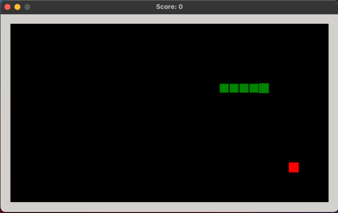

# Snake Game (Made with C and SDL 2.0)
Snake is a classic video game from the late 70s and became popular when Snake 2 was bundled with the Nokia 3310 in 2000.



## How to Play
The goal is to navigate the snake and eat as many apples as possible without touching the walls or the snake's body.

- Move the Snake with the <kbd>↑</kbd> <kbd>↓</kbd> <kbd>←</kbd> <kbd>→</kbd> arrow keys.
- Press <kbd>esc</kbd> to exit the game.
- Press <kbd>space</kbd> to pause/resume the game (or to start a new game when the snake has died).

## Building
Before you can build this project, you will need to install **SDL 2** on your machine. It can be installed on macOS with Homebrew using the command.

```
brew install sdl2
```

Clone the repository and change into the **csnake** directory.

```
git clone git@github.com:tonymackay/csnake.git && cd csnake
```

Then run `make` or `make debug`.

Note: this project is part of a tutorial I am writing on Medium and so far it has only been tested on macOS Big Sur.

